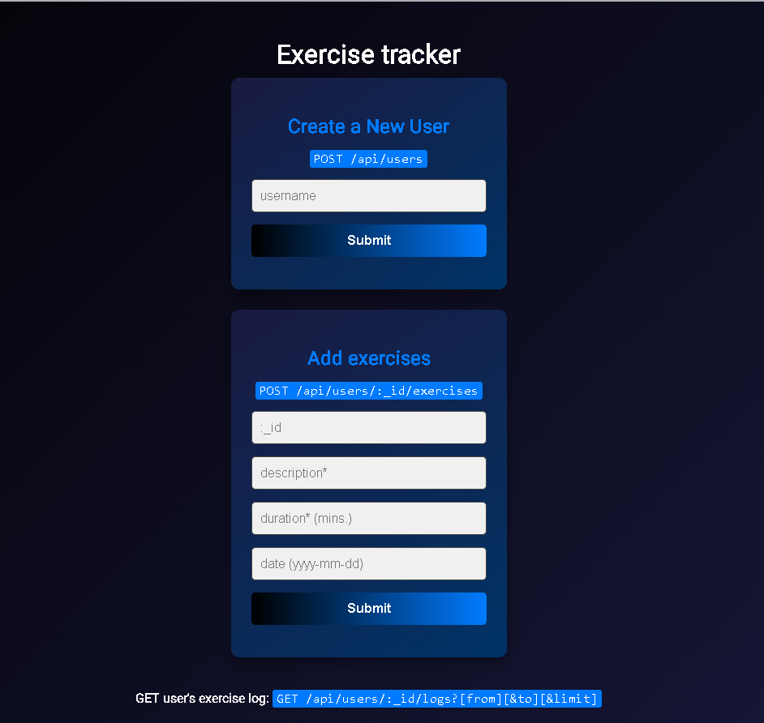

# Exercise Tracker API

## Descripción

Este proyecto es una API y aplicación web para el seguimiento de ejercicios, desarrollada con Node.js, Express y MongoDB (Mongoose). Permite crear usuarios, registrar ejercicios y consultar el historial de actividades de cada usuario.

---

## Estructura del Proyecto

```
├── index.js                # Punto de entrada principal
├── package.json            # Dependencias y scripts
├── assets/
│   └── exercisetracker.png # Imagen de vista previa
├── config/
│   └── db.js               # Configuración de la base de datos
├── controllers/
│   └── userController.js   # Lógica de negocio de usuarios y ejercicios
├── models/
│   └── User.js             # Esquema y modelo de usuario
├── public/
│   └── style.css           # Estilos de la aplicación web
├── routes/
│   └── users.js            # Rutas de la API
├── views/
│   └── index.html          # Interfaz web
```

---

## Funcionamiento

- **Crear usuario:**
  - POST `/api/users` con el campo `username`.
  - Devuelve el usuario creado y su `_id`.
- **Listar usuarios:**
  - GET `/api/users`
  - Devuelve un array de usuarios registrados.
- **Agregar ejercicio:**
  - POST `/api/users/:_id/exercises` con los campos `description`, `duration`, y opcionalmente `date`.
  - Devuelve el ejercicio agregado al usuario.
- **Ver historial de ejercicios:**
  - GET `/api/users/:_id/logs?[from][&to][&limit]`
  - Devuelve el usuario, el número de ejercicios y el log filtrado por fecha o cantidad.

---

## Instalación y uso

1. Clona el repositorio y entra en la carpeta del proyecto.
2. Instala las dependencias:
   ```sh
   npm install
   ```
3. Configura tu archivo `.env` con la cadena de conexión de MongoDB:
   ```env
   MONGO_URI=tu_cadena_de_conexion
   PORT=3000
   ```
4. Inicia el servidor:
   ```sh
   npm start
   ```
5. Abre `http://localhost:3000` en tu navegador para usar la interfaz web.

---

## Características

- API RESTful para usuarios y ejercicios
- Filtros por fecha y límite en logs
- Validación de unicidad de usuario
- Interfaz web moderna y responsiva
- Código modular y fácil de mantener

---

## Vista previa



---

## Licencia

MIT
